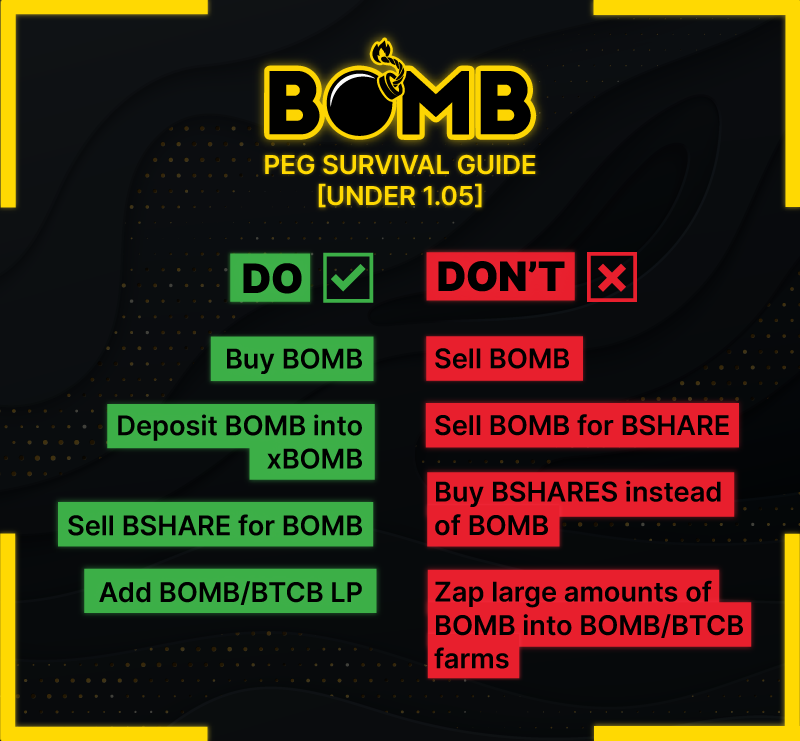

# Migrating Positions Properly

To allow for the BOMB protocol to stay healthy, it is essential that we all work as a team by minimizing sells on our tokens, especially BOMB, whilst we are under 1.10 peg (minimal 1.05 peg). We offer many incentivized farms which users bounce between very often. The following guide was created to help our investors enter each farm with minimal impact to the protocol, making sure everybody wins! If you have any further questions after reading this article, please talk to our support staff in Discord or Telegram.

## XBOMB to BOMB Maxi

Many of our users have accumulated a large amount of xBOMB, be that through buying BOMB or receiving boardroom prints. If you would rather be farming for BSHARE rewards, we recommend the following strategy.


**Important note!** Zapping just BOMB into the BOMB Maxi pool will cause a Balancer sell. You won’t see it as a sell, however the underlying bots will sell 20% of your BOMB for BTCB. This is why we suggest doing this in small chunks, to avoid large, unnecessary BOMB sells.


* Unstake a small amount from the xBOMB contract (we recommend a max of 500 BOMB).
* Acquire ¼ of the USD value of your BOMB in BTCB. Ideally add new funds to avoiding selling any BOMB or if you have any BSHARE rewards from farms, convert them to BTCB.
* Head to [Acsi Finance Bomb MAXI](https://app.acsi.finance/#/pool/0xd6f52e8ab206e59a1e13b3d6c5b7f31e90ef46ef000200000000000000000028) and click **Invest**.&#x20;
* Click **Max**, then **Preview**, then **Invest**. (If you have BTCB, click “**Proportional Suggestion**”)

.png>)

* Head to our [Manual Farm staking page](https://app.bomb.money/farm/BombMaxiLPBShareRewardPool), and click then “**+**” button to add your LP.&#x20;

## MAXI pools to Core 50%-50% pools

For BOMB Maxi to BOMB/BTCB 50/50% we only recommend doing this when we are over 1.05 peg, unless you can add funds to avoid selling any BOMB! For BSHARE MAXI to BSHARE/BNB 50/50%, this be can done at any time, just try to do small amounts at a time!

Users switching from our Maxi pools to our original 50/50 pools normally do so due to one of two reasons;

* The 50/50 farm is paying a higher APR.
* The 50/50 farm is less volatile, some users prefer this.

### BOMB MAXI to BOMB/BTCB 50/50

Firstly, un-stake your LP from our manual farm [here](https://app.bomb.money/farm/BombMaxiLPBShareRewardPool). After this, go to [Acsi Finance BOMB Maxi](https://app.acsi.finance/#/pool/0xd6f52e8ab206e59a1e13b3d6c5b7f31e90ef46ef000200000000000000000028) and press “**WITHDRAW**” to separate your LP. &#x20;

.png>)

Then, ideally, add enough extra BTCB to balance out your BOMB and BTCB holdings. Remember, an easy way to gather extra BTCB funds is to sell your BSHARE paying manual farm rewards!

Once you have your balanced assets ready (50% BOMB, 50% BTCB), head over to Pancakeswap and [add BOMB/BTCB liquidity](https://pancakeswap.finance/add/0x7130d2A12B9BCbFAe4f2634d864A1Ee1Ce3Ead9c/0x522348779DCb2911539e76A1042aA922F9C47Ee3). &#x20;

After you have added liquidity, you have two options. You can add to our manual farms to earn BSHARE or you can enter our auto compounding vault to earn more LP tokens.

* To enter our manual farm to earn BSHARES deposit your LP [here](https://app.bomb.money/farm/BombBtcbLPBShareRewardPool).&#x20;
* To enter our Auto-compounding vault, deposit your LP [here](https://www.bomb.farm/#/bsc).&#x20;

### BSHARE MAXI to BSHARE/BNB 50/50&#x20;

This process is very similar to above, start by unstaking your LP from [here](https://app.bomb.money/farm/BshareMaxiLPBShareRewardPool). Then head over to [Acsi Finance](https://app.acsi.finance/#/pool/0x2c374ed1575e5c2c02c569f627299e902a1972cb000200000000000000000027) and “**WITHDRAW**” your assets. &#x20;


**Important note**! You will receive WBNB when you break your LP, convert this to BNB on any swap site you use! [1inch](https://app.1inch.io/#/56/swap/WBNB/BNB) or Pancakeswap both work great.&#x20;


Once you have the correct two assets, if you have extra funds available convert them to BNB to balance out your BSHARE and BNB holdings. If you do not, sell some BSHARE (in small amounts) to achieve this instead.

When you have the right amount of each asset ready, head to Pancakeswap and [add BSHARE/BNB liquidity](https://pancakeswap.finance/add/BNB/0x531780FAcE85306877D7e1F05d713D1B50a37F7A). Similarly to above, after you have added liquidity, you have two options. You can add to our manual farms to earn BSHARE or you can enter our auto compounding vault to earn more LP tokens.

* To enter our manual farm to earn BSHARES deposit your LP [here](https://app.bomb.money/farm/BshareBnbLPBShareRewardPool).&#x20;
* To enter our Auto-compounding vault, deposit your LP [here](https://www.bomb.farm/#/bsc).&#x20;

## To wrap it all up!

If we can get everyone to follow the above instructions when switching between our farming options, we are a step closer to being able to print forever. The more people we can educate and guide, the faster BOMB will grow and bring in new investors! Remember, if you’re ever in doubt, please ask any of our team who will be more than happy to assist you.

